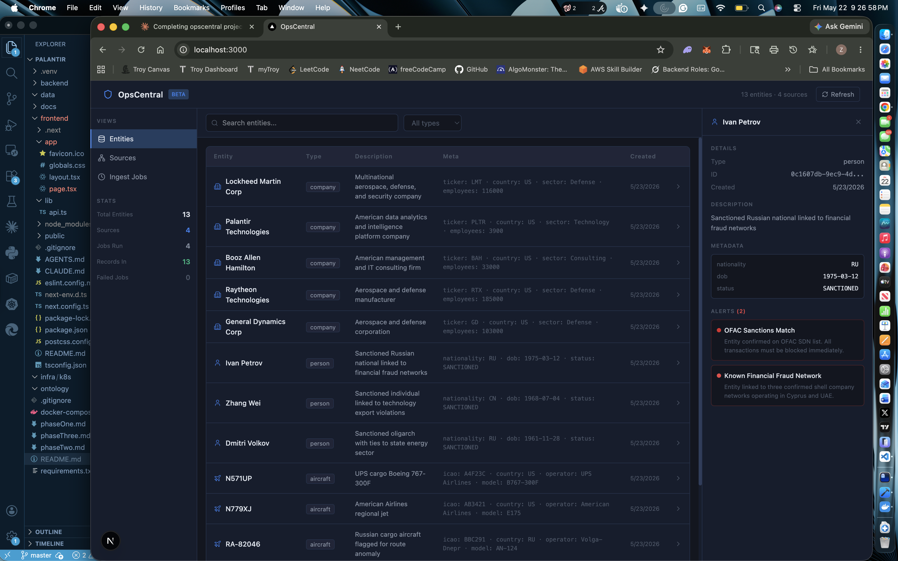

# OpsCentral

A Palantir-style data intelligence platform for tracking entities, ingesting multi-source data, and surfacing alerts. Built as a portfolio project targeting defense, fintech, and enterprise data roles.



## Stack

| Layer | Technology |
|---|---|
| Frontend | Next.js 15, TypeScript, Tailwind CSS |
| Backend | FastAPI, Python 3.12 |
| Database | PostgreSQL 15 |
| ORM | SQLAlchemy + Alembic |
| Infrastructure | Docker, docker-compose |

## Features

- **Entity tracking** — monitor companies, persons, vessels, aircraft, and IP addresses across multiple data sources
- **Multi-source ingestion** — ingest records from any source via a single REST endpoint with full job logging
- **Alert system** — create and track alerts on entities with severity levels (low / medium / high / critical)
- **Live search and filtering** — search entities by name, filter by type, with server-side pagination
- **Ingestion job history** — full audit log of every ingest run with status, record count, and duration
- **Entity detail panel** — click any entity to see full metadata, source info, and active alerts

## Architecture
**Frontend** (Next.js 15, port 3000) → HTTP → **Backend** (FastAPI, port 8000) → SQL → **Database** (PostgreSQL, port 5433)

Database migrations managed by **Alembic**.

## Data Model

- **entities** — core tracked objects with type, description, and JSON metadata
- **sources** — registered data sources (SEC EDGAR, OFAC, OpenSky, AIS, etc.)
- **ingestion_jobs** — audit log of every ingest run
- **alerts** — flagged conditions on entities with severity levels
- **entity_relationships** — directed links between entities
- **entity_sources** — junction table linking entities to their originating sources

## API Reference

| Method | Endpoint | Description |
|---|---|---|
| GET | `/health` | Health check |
| GET | `/entities` | List entities with search, filter, pagination |
| GET | `/entities/{id}` | Get single entity with alerts |
| POST | `/ingest` | Ingest a batch of records from a named source |
| GET | `/jobs` | List last 20 ingestion jobs |
| GET | `/sources` | List all registered sources |
| POST | `/alerts` | Create an alert on an entity |

Interactive API docs available at `http://localhost:8000/docs` when running locally.

## Running Locally

### Prerequisites
- Docker Desktop
- Python 3.12
- Node.js 18+

### Setup

**1. Clone the repo**
```bash
git clone https://github.com/zw22x/opscentral.git
cd opscentral
```

**2. Start the database**
```bash
docker compose up postgres -d
```

**3. Set up the backend**
```bash
cd backend
python3 -m venv .venv
source .venv/bin/activate
pip install -r requirements.txt
python3 -m alembic upgrade head
python3 -m uvicorn connector-service.main:app --reload --port 8000
```

**4. Start the frontend**
```bash
cd frontend
npm install
npm run dev
```

**5. Open the dashboard**

Navigate to `http://localhost:3000`

### Seed sample data

```bash
curl -X POST http://localhost:8000/ingest \
  -H "Content-Type: application/json" \
  -d '{
    "source_name": "SEC EDGAR",
    "source_type": "api",
    "entity_type": "company",
    "records": [
      {"name": "Lockheed Martin Corp", "description": "Defense and aerospace manufacturer", "meta": {"ticker": "LMT", "country": "US"}}
    ]
  }'
```

## Project Structure
```
opscentral/
├── docker-compose.yml
├── backend/
│   ├── Dockerfile
│   ├── requirements.txt
│   ├── alembic/                  # database migrations
│   ├── models/
│   │   ├── base.py               # SQLAlchemy engine + session
│   │   └── entities.py           # all table definitions
│   ├── pipelines/
│   │   └── ingest.py             # ingestion pipeline logic
│   └── connector-service/
│       └── main.py               # FastAPI routes
└── frontend/
    ├── app/
    │   ├── globals.css            # dark theme CSS variables
    │   ├── layout.tsx
    │   └── page.tsx               # main dashboard
    └── lib/
        └── api.ts                 # typed API client
```

## Roadmap

- [ ] Neo4j graph layer for entity relationship visualization
- [ ] WebSocket feed for real-time alert notifications
- [ ] Authentication with JWT
- [ ] Automated ingestion from live APIs (OpenSky, SEC EDGAR, OFAC)
- [ ] Export to CSV / PDF reports